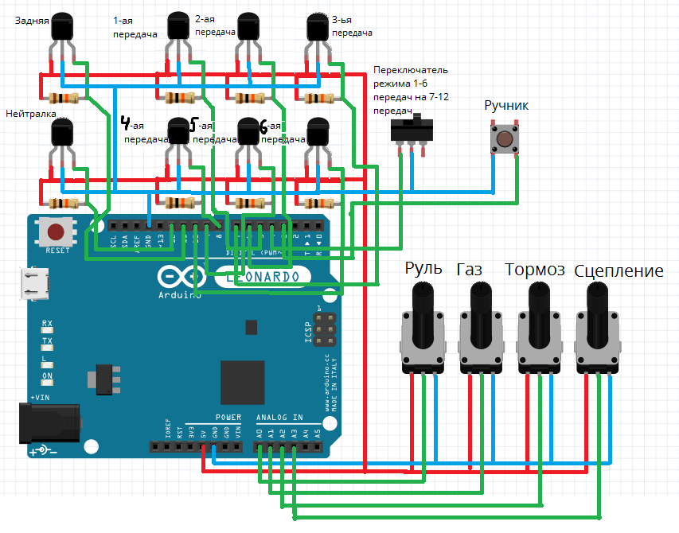

# Игровой руль на Ардуино леонардо
 Gaming steering wheel on Arduino leonardo

# Схема подключения

Нам нужно:

8х Датчик Холла A3144

4x Потенциометра

1х Кнопка

1х Переключатель

1х Arduino Leonardo/Micro

